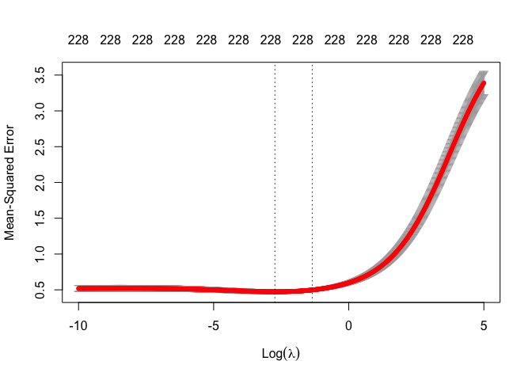
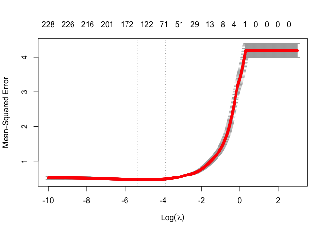
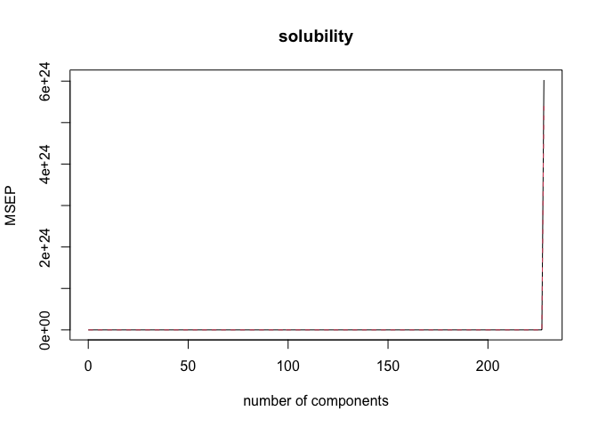

DSII HW1
================

``` r
library(tidyverse)
library(ISLR)
library(glmnet)
library(caret)
library(corrplot)
library(plotmo)
library(pls)
```

``` r
# setups

test = read_csv("./data/solubility_test.csv") %>%
  janitor::clean_names() %>% 
  na.omit()

train = read.csv("./data/solubility_train.csv") %>%
  janitor::clean_names() %>% 
  na.omit()

xtrain = model.matrix(solubility ~., train)[,-1]
ytrain = train$solubility
```

# Question 1: Linear model

``` r
set.seed(1)

lm_fit = lm(solubility ~., data = train)
final_lm = predict(lm_fit, newdata = test)
mse_lm = mean((final_lm - test$solubility)^2)
mse_lm
```

    ## [1] 0.5558898

MSE of the linear model fitting on the training data is 0.5558898.

# Question 2: Ridge regression model

``` r
set.seed(1)

# Cross Validation
cv.ridge = cv.glmnet(xtrain, ytrain, 
                     type.measure = "mse",
                     alpha = 0,
                     lambda = exp(seq(-10, 5, length = 1000)))
plot(cv.ridge)
```

<!-- -->

``` r
cv.ridge$lambda.min # min MSE
```

    ## [1] 0.06504131

``` r
cv.ridge$lambda.1se # 1se
```

    ## [1] 0.2588902

``` r
ridge = glmnet(xtrain, ytrain, 
               standardize = TRUE,
               alpha = 0,
               lambda = cv.ridge$lambda.min)
final_ridge = predict(ridge, newx = model.matrix(solubility ~., test)[,-1], s = cv.ridge$lambda.min, type = "response")
mse_ridge = mean((final_ridge - test$solubility)^2)
mse_ridge
```

    ## [1] 0.5133069

MSE of Ridge model is 0.5133069.

# Question 3: Lasso Model

``` r
set.seed(1)

cv.lasso = cv.glmnet(xtrain, ytrain, 
                     type.measure = "mse",
                     alpha = 1,
                     lambda = exp(seq(-10, 3, length = 1000)))
plot(cv.lasso)
```

<!-- -->

``` r
cv.lasso$lambda.min # min MSE
```

    ## [1] 0.0046664

``` r
cv.lasso$lambda.1se # 1se
```

    ## [1] 0.02111318

``` r
lasso = glmnet(xtrain, ytrain, 
               standardize = TRUE,
               alpha = 1,
               lambda = cv.lasso$lambda.min)
final_lasso = predict(lasso, newx = model.matrix(solubility ~., test)[,-1], s = cv.lasso$lambda.min, type = "response")
mse_lasso = mean((final_lasso - test$solubility)^2)
mse_lasso
```

    ## [1] 0.4950328

``` r
sum(final_lasso!=0) # non-zero coefficients
```

    ## [1] 316

MSE of Lasso Regression is 0.4950328. The number of non-zero coefficient
estimates is 316.

# Question 4: Principle Component Regression Model

``` r
set.seed(1)
pcr = pcr(solubility ~., data = train, scale = TRUE, validation = "CV")
summary(pcr) # n of components = 228
```

    ## Data:    X dimension: 951 228 
    ##  Y dimension: 951 1
    ## Fit method: svdpc
    ## Number of components considered: 228
    ## 
    ## VALIDATION: RMSEP
    ## Cross-validated using 10 random segments.
    ##        (Intercept)  1 comps  2 comps  3 comps  4 comps  5 comps  6 comps
    ## CV           2.048    2.044    1.979    1.712    1.605    1.582    1.451
    ## adjCV        2.048    2.044    1.978    1.711    1.602    1.618    1.450
    ##        7 comps  8 comps  9 comps  10 comps  11 comps  12 comps  13 comps
    ## CV       1.301    1.295    1.295     1.277     1.254     1.248     1.243
    ## adjCV    1.297    1.292    1.294     1.276     1.249     1.246     1.243
    ##        14 comps  15 comps  16 comps  17 comps  18 comps  19 comps  20 comps
    ## CV        1.198     1.181     1.120     1.062     1.051     1.040     1.019
    ## adjCV     1.197     1.183     1.117     1.054     1.049     1.038     1.012
    ##        21 comps  22 comps  23 comps  24 comps  25 comps  26 comps  27 comps
    ## CV        1.008     1.007    0.9778    0.9785    0.9757    0.9695    0.9683
    ## adjCV     1.006     1.007    0.9742    0.9759    0.9742    0.9661    0.9663
    ##        28 comps  29 comps  30 comps  31 comps  32 comps  33 comps  34 comps
    ## CV       0.9637    0.9661    0.9665    0.9468    0.9310    0.9192    0.9202
    ## adjCV    0.9629    0.9645    0.9673    0.9438    0.9285    0.9159    0.9188
    ##        35 comps  36 comps  37 comps  38 comps  39 comps  40 comps  41 comps
    ## CV       0.9023    0.8882    0.8802    0.8814    0.8828    0.8724    0.8709
    ## adjCV    0.9004    0.8854    0.8768    0.8784    0.8838    0.8688    0.8684
    ##        42 comps  43 comps  44 comps  45 comps  46 comps  47 comps  48 comps
    ## CV       0.8715    0.8657    0.8515    0.8495    0.8519    0.8451    0.8446
    ## adjCV    0.8702    0.8659    0.8491    0.8458    0.8489    0.8420    0.8420
    ##        49 comps  50 comps  51 comps  52 comps  53 comps  54 comps  55 comps
    ## CV       0.8441    0.8436    0.8401    0.8351    0.8326    0.8328    0.8323
    ## adjCV    0.8415    0.8419    0.8386    0.8305    0.8297    0.8295    0.8297
    ##        56 comps  57 comps  58 comps  59 comps  60 comps  61 comps  62 comps
    ## CV       0.8334    0.8304    0.8273    0.8255    0.8219    0.8103    0.8085
    ## adjCV    0.8309    0.8313    0.8295    0.8242    0.8205    0.8027    0.8023
    ##        63 comps  64 comps  65 comps  66 comps  67 comps  68 comps  69 comps
    ## CV       0.8114    0.8103    0.8111    0.8157    0.8104    0.8110    0.8088
    ## adjCV    0.8063    0.8067    0.8076    0.8133    0.8070    0.8084    0.8055
    ##        70 comps  71 comps  72 comps  73 comps  74 comps  75 comps  76 comps
    ## CV       0.8081    0.8069    0.7986    0.7993    0.7972    0.7967    0.7950
    ## adjCV    0.8052    0.8061    0.7922    0.7933    0.7917    0.7922    0.7911
    ##        77 comps  78 comps  79 comps  80 comps  81 comps  82 comps  83 comps
    ## CV       0.7934    0.7936    0.7895    0.7905    0.7903    0.7932    0.7952
    ## adjCV    0.7904    0.7908    0.7855    0.7871    0.7875    0.7881    0.7918
    ##        84 comps  85 comps  86 comps  87 comps  88 comps  89 comps  90 comps
    ## CV       0.7944    0.7932    0.7929    0.7935    0.7934    0.7921    0.7883
    ## adjCV    0.7915    0.7884    0.7885    0.7903    0.7906    0.7902    0.7861
    ##        91 comps  92 comps  93 comps  94 comps  95 comps  96 comps  97 comps
    ## CV       0.7875    0.7865    0.7861    0.7834    0.7812    0.7802    0.7833
    ## adjCV    0.7829    0.7794    0.7790    0.7769    0.7756    0.7749    0.7791
    ##        98 comps  99 comps  100 comps  101 comps  102 comps  103 comps
    ## CV        0.784    0.7850     0.7816     0.7759     0.7758     0.7695
    ## adjCV     0.780    0.7818     0.7751     0.7707     0.7709     0.7660
    ##        104 comps  105 comps  106 comps  107 comps  108 comps  109 comps
    ## CV        0.7658     0.7647     0.7651     0.7661     0.7668     0.7647
    ## adjCV     0.7598     0.7593     0.7603     0.7617     0.7635     0.7572
    ##        110 comps  111 comps  112 comps  113 comps  114 comps  115 comps
    ## CV        0.7665     0.7636     0.7602     0.7627     0.7639     0.7665
    ## adjCV     0.7596     0.7577     0.7554     0.7584     0.7592     0.7626
    ##        116 comps  117 comps  118 comps  119 comps  120 comps  121 comps
    ## CV        0.7657     0.7668     0.7648     0.7624      0.762     0.7597
    ## adjCV     0.7607     0.7626     0.7636     0.7611      0.761     0.7529
    ##        122 comps  123 comps  124 comps  125 comps  126 comps  127 comps
    ## CV        0.7579     0.7572     0.7568     0.7548      0.749     0.7489
    ## adjCV     0.7531     0.7527     0.7521     0.7466      0.742     0.7435
    ##        128 comps  129 comps  130 comps  131 comps  132 comps  133 comps
    ## CV        0.7482     0.7482     0.7433     0.7367     0.7375     0.7374
    ## adjCV     0.7443     0.7429     0.7410     0.7289     0.7282     0.7287
    ##        134 comps  135 comps  136 comps  137 comps  138 comps  139 comps
    ## CV        0.7343     0.7294     0.7282     0.7303     0.7282     0.7280
    ## adjCV     0.7276     0.7247     0.7216     0.7240     0.7224     0.7224
    ##        140 comps  141 comps  142 comps  143 comps  144 comps  145 comps
    ## CV        0.7276     0.7208     0.7206     0.7174     0.7156     0.7121
    ## adjCV     0.7219     0.7139     0.7154     0.7147     0.7059     0.7048
    ##        146 comps  147 comps  148 comps  149 comps  150 comps  151 comps
    ## CV        0.7117     0.7085     0.7082     0.7066     0.7061     0.7081
    ## adjCV     0.7038     0.7014     0.6993     0.6990     0.6980     0.7008
    ##        152 comps  153 comps  154 comps  155 comps  156 comps  157 comps
    ## CV        0.7055     0.7071     0.7106     0.7114     0.7102     0.7106
    ## adjCV     0.6985     0.7001     0.7043     0.7034     0.7030     0.7020
    ##        158 comps  159 comps  160 comps  161 comps  162 comps  163 comps
    ## CV        0.7086     0.7096     0.7104     0.7114     0.7106     0.7125
    ## adjCV     0.7001     0.7018     0.7027     0.7031     0.7029     0.7057
    ##        164 comps  165 comps  166 comps  167 comps  168 comps  169 comps
    ## CV        0.7138     0.7153     0.7162     0.7145     0.7154     0.7147
    ## adjCV     0.7059     0.7078     0.7073     0.7062     0.7072     0.7069
    ##        170 comps  171 comps  172 comps  173 comps  174 comps  175 comps
    ## CV        0.7146     0.7167     0.7188     0.7191     0.7169     0.7143
    ## adjCV     0.7065     0.7085     0.7107     0.7116     0.7085     0.7066
    ##        176 comps  177 comps  178 comps  179 comps  180 comps  181 comps
    ## CV        0.7185     0.7188     0.7156     0.7169     0.7157     0.7161
    ## adjCV     0.7095     0.7096     0.7075     0.7089     0.7081     0.7071
    ##        182 comps  183 comps  184 comps  185 comps  186 comps  187 comps
    ## CV        0.7188     0.7183     0.7182     0.7176     0.7184     0.7211
    ## adjCV     0.7103     0.7088     0.7096     0.7090     0.7083     0.7115
    ##        188 comps  189 comps  190 comps  191 comps  192 comps  193 comps
    ## CV        0.7234     0.7241     0.7248     0.7242     0.7276     0.7298
    ## adjCV     0.7138     0.7146     0.7154     0.7151     0.7186     0.7207
    ##        194 comps  195 comps  196 comps  197 comps  198 comps  199 comps
    ## CV        0.7338     0.7331     0.7312     0.7334     0.7329     0.7384
    ## adjCV     0.7240     0.7236     0.7194     0.7230     0.7227     0.7286
    ##        200 comps  201 comps  202 comps  203 comps  204 comps  205 comps
    ## CV        0.7375     0.7392     0.7345     0.7387     0.7401     0.7355
    ## adjCV     0.7263     0.7283     0.7231     0.7275     0.7290     0.7247
    ##        206 comps  207 comps  208 comps  209 comps  210 comps  211 comps
    ## CV        0.7321     0.7323     0.7268     0.7202     0.7258     0.7274
    ## adjCV     0.7197     0.7210     0.7151     0.7085     0.7142     0.7158
    ##        212 comps  213 comps  214 comps  215 comps  216 comps  217 comps
    ## CV        0.7371     0.7405     0.7448     0.7441     0.7428     0.7414
    ## adjCV     0.7247     0.7280     0.7319     0.7312     0.7299     0.7272
    ##        218 comps  219 comps  220 comps  221 comps  222 comps  223 comps
    ## CV        0.7454     0.7420     0.7433     0.7508     0.7494     0.7489
    ## adjCV     0.7314     0.7286     0.7300     0.7372     0.7360     0.7348
    ##        224 comps  225 comps  226 comps  227 comps  228 comps
    ## CV        0.7468     0.7432     0.7455     0.7434  2.455e+12
    ## adjCV     0.7333     0.7292     0.7314     0.7310  2.329e+12
    ## 
    ## TRAINING: % variance explained
    ##             1 comps  2 comps  3 comps  4 comps  5 comps  6 comps  7 comps
    ## X            12.417   23.083    30.29    34.91    39.27    43.53    46.98
    ## solubility    0.734    7.182    30.52    39.36    39.52    50.82    60.83
    ##             8 comps  9 comps  10 comps  11 comps  12 comps  13 comps  14 comps
    ## X             50.08    53.04     55.46     57.67     59.81     61.72     63.43
    ## solubility    61.00    61.01     62.57     64.10     64.17     64.36     67.12
    ##             15 comps  16 comps  17 comps  18 comps  19 comps  20 comps
    ## X              64.82     66.16     67.40     68.58     69.68     70.73
    ## solubility     68.79     71.69     74.75     74.96     75.59     76.72
    ##             21 comps  22 comps  23 comps  24 comps  25 comps  26 comps
    ## X              71.76     72.72     73.64     74.48     75.31     76.09
    ## solubility     76.96     77.00     78.34     78.40     78.48     78.97
    ##             27 comps  28 comps  29 comps  30 comps  31 comps  32 comps
    ## X              76.85     77.57     78.29     78.95     79.59     80.22
    ## solubility     79.03     79.20     79.42     79.43     80.34     80.94
    ##             33 comps  34 comps  35 comps  36 comps  37 comps  38 comps
    ## X              80.81     81.38     81.92     82.46     82.96     83.45
    ## solubility     81.52     81.53     82.15     82.66     82.96     82.97
    ##             39 comps  40 comps  41 comps  42 comps  43 comps  44 comps
    ## X              83.92     84.37     84.82     85.23     85.64     86.03
    ## solubility     82.98     83.49     83.58     83.61     83.73     84.41
    ##             45 comps  46 comps  47 comps  48 comps  49 comps  50 comps
    ## X              86.42     86.78     87.13     87.46     87.77     88.08
    ## solubility     84.54     84.56     84.82     84.82     84.93     84.99
    ##             51 comps  52 comps  53 comps  54 comps  55 comps  56 comps
    ## X              88.39     88.68     88.97     89.25     89.52     89.77
    ## solubility     85.19     85.46     85.48     85.55     85.57     85.61
    ##             57 comps  58 comps  59 comps  60 comps  61 comps  62 comps
    ## X              90.02     90.26     90.51     90.75     90.97     91.19
    ## solubility     85.62     85.70     85.89     86.12     86.61     86.65
    ##             63 comps  64 comps  65 comps  66 comps  67 comps  68 comps
    ## X              91.41     91.62     91.83     92.03     92.23     92.42
    ## solubility     86.66     86.66     86.67     86.69     86.82     86.83
    ##             69 comps  70 comps  71 comps  72 comps  73 comps  74 comps
    ## X              92.60     92.77     92.95     93.12     93.28     93.44
    ## solubility     86.92     86.94     87.00     87.45     87.48     87.50
    ##             75 comps  76 comps  77 comps  78 comps  79 comps  80 comps
    ## X              93.60     93.76     93.91     94.06     94.20     94.34
    ## solubility     87.51     87.55     87.57     87.62     87.74     87.76
    ##             81 comps  82 comps  83 comps  84 comps  85 comps  86 comps
    ## X              94.47     94.61     94.74     94.86     94.99     95.11
    ## solubility     87.83     87.95     87.95     88.00     88.11     88.11
    ##             87 comps  88 comps  89 comps  90 comps  91 comps  92 comps
    ## X              95.22     95.34     95.45     95.56     95.66     95.77
    ## solubility     88.13     88.14     88.14     88.23     88.41     88.60
    ##             93 comps  94 comps  95 comps  96 comps  97 comps  98 comps
    ## X              95.87     95.97     96.07     96.16     96.26     96.35
    ## solubility     88.67     88.68     88.71     88.72     88.72     88.74
    ##             99 comps  100 comps  101 comps  102 comps  103 comps  104 comps
    ## X              96.44      96.53      96.61      96.70      96.78      96.86
    ## solubility     88.74      88.94      88.97      89.02      89.12      89.30
    ##             105 comps  106 comps  107 comps  108 comps  109 comps  110 comps
    ## X               96.94      97.02      97.09      97.17      97.24      97.31
    ## solubility      89.33      89.33      89.34      89.39      89.62      89.64
    ##             111 comps  112 comps  113 comps  114 comps  115 comps  116 comps
    ## X               97.38      97.45      97.51      97.58      97.64      97.70
    ## solubility      89.65      89.66      89.77      89.81      89.81      89.87
    ##             117 comps  118 comps  119 comps  120 comps  121 comps  122 comps
    ## X               97.76      97.82      97.88      97.94      98.00      98.05
    ## solubility      89.88      89.88      90.00      90.06      90.34      90.36
    ##             123 comps  124 comps  125 comps  126 comps  127 comps  128 comps
    ## X               98.11      98.16      98.21      98.26      98.31      98.36
    ## solubility      90.44      90.49      90.67      90.69      90.70      90.70
    ##             129 comps  130 comps  131 comps  132 comps  133 comps  134 comps
    ## X               98.41      98.45      98.50      98.54      98.59      98.63
    ## solubility      90.79      90.79      91.14      91.24      91.25      91.25
    ##             135 comps  136 comps  137 comps  138 comps  139 comps  140 comps
    ## X               98.67      98.71      98.75      98.79      98.82      98.86
    ## solubility      91.25      91.34      91.39      91.41      91.42      91.49
    ##             141 comps  142 comps  143 comps  144 comps  145 comps  146 comps
    ## X               98.89      98.93      98.96      99.00      99.03      99.06
    ## solubility      91.63      91.65      91.65      91.91      91.91      91.96
    ##             147 comps  148 comps  149 comps  150 comps  151 comps  152 comps
    ## X               99.09      99.12      99.15      99.18      99.20      99.23
    ## solubility      91.97      92.06      92.06      92.12      92.12      92.12
    ##             153 comps  154 comps  155 comps  156 comps  157 comps  158 comps
    ## X               99.26      99.28      99.31      99.33      99.35      99.38
    ## solubility      92.15      92.16      92.26      92.26      92.35      92.37
    ##             159 comps  160 comps  161 comps  162 comps  163 comps  164 comps
    ## X               99.40      99.42      99.44      99.46      99.48      99.50
    ## solubility      92.37      92.37      92.40      92.41      92.41      92.47
    ##             165 comps  166 comps  167 comps  168 comps  169 comps  170 comps
    ## X               99.52      99.54      99.56      99.57      99.59      99.61
    ## solubility      92.47      92.53      92.54      92.55      92.55      92.57
    ##             171 comps  172 comps  173 comps  174 comps  175 comps  176 comps
    ## X               99.62      99.64      99.65      99.67      99.68       99.7
    ## solubility      92.58      92.58      92.58      92.64      92.64       92.7
    ##             177 comps  178 comps  179 comps  180 comps  181 comps  182 comps
    ## X               99.71      99.73      99.74      99.75      99.76      99.77
    ## solubility      92.72      92.72      92.76      92.76      92.84      92.84
    ##             183 comps  184 comps  185 comps  186 comps  187 comps  188 comps
    ## X               99.79       99.8      99.81      99.82      99.83      99.84
    ## solubility      92.89       92.9      92.92      92.98      92.98      92.99
    ##             189 comps  190 comps  191 comps  192 comps  193 comps  194 comps
    ## X               99.85      99.86      99.86      99.87      99.88      99.89
    ## solubility      93.00      93.02      93.02      93.02      93.03      93.07
    ##             195 comps  196 comps  197 comps  198 comps  199 comps  200 comps
    ## X               99.90      99.90      99.91      99.92      99.92      99.93
    ## solubility      93.11      93.24      93.24      93.25      93.26      93.35
    ##             201 comps  202 comps  203 comps  204 comps  205 comps  206 comps
    ## X               99.94      99.94      99.95      99.95      99.96      99.96
    ## solubility      93.35      93.42      93.42      93.42      93.48      93.57
    ##             207 comps  208 comps  209 comps  210 comps  211 comps  212 comps
    ## X               99.97      99.97      99.97      99.98      99.98      99.98
    ## solubility      93.57      93.65      93.69      93.70      93.70      93.73
    ##             213 comps  214 comps  215 comps  216 comps  217 comps  218 comps
    ## X               99.99      99.99      99.99      99.99      99.99      99.99
    ## solubility      93.73      93.76      93.78      93.82      93.88      93.90
    ##             219 comps  220 comps  221 comps  222 comps  223 comps  224 comps
    ## X              100.00     100.00     100.00     100.00     100.00     100.00
    ## solubility      93.92      93.93      93.94      93.97      94.04      94.04
    ##             225 comps  226 comps  227 comps  228 comps
    ## X              100.00     100.00     100.00     100.00
    ## solubility      94.16      94.16      94.16      94.46

``` r
validationplot(pcr, val.type = "MSEP")
```

<!-- -->

``` r
final_pcr = predict(pcr, newdata = test, ncomp = 228)
mse_pcr = mean((final_pcr - test$solubility)^2)
mse_pcr
```

    ## [1] 0.5558898

MSE of PCR is 0.5558898, wit M selected as 228.

# Question 5

``` r
data.frame(mse_lm, mse_ridge, mse_lasso, mse_pcr)
```

    ##      mse_lm mse_ridge mse_lasso   mse_pcr
    ## 1 0.5558898 0.5133069 0.4950328 0.5558898

To make the results comparable, MSE is selected to be the criteria of
test error. Based on the table above, Lasso model has the least MSE,
therefore, Lasso is preferred to predict solubility.
