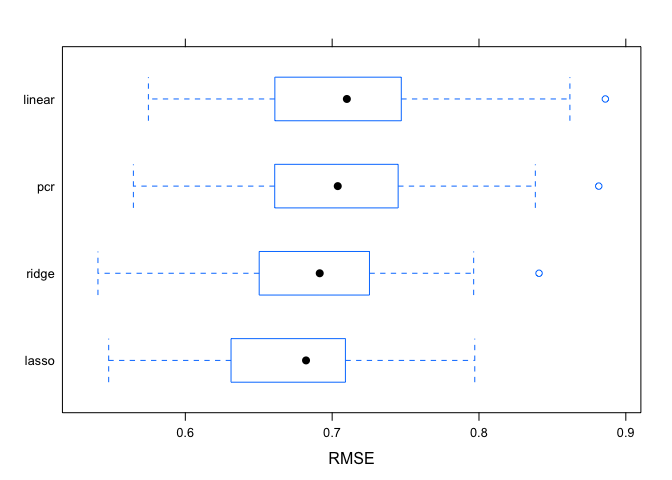

DSII HW1
================

``` r
library(tidyverse)
library(ISLR)
library(glmnet)
library(caret)
library(corrplot)
library(plotmo)
library(pls)
```

``` r
# setups

test = read_csv("./data/solubility_test.csv") %>%
  janitor::clean_names() %>% 
  na.omit()

train = read.csv("./data/solubility_train.csv") %>%
  janitor::clean_names() %>% 
  na.omit()

xtrain = model.matrix(solubility ~., train)[,-1]
ytrain = train$solubility
```

# Question 1: Linear model

``` r
set.seed(1)

lm_fit = lm(solubility ~., data = train)
final_lm = predict(lm_fit, newdata = test)
mse_lm = mean((final_lm - test$solubility)^2)
mse_lm
```

    ## [1] 0.5558898

MSE of the linear model fitting on the training data is 0.5558898.

# Question 2: Ridge regression model

``` r
set.seed(1)

# Cross Validation
cv.ridge = cv.glmnet(xtrain, ytrain, 
                     type.measure = "mse",
                     alpha = 0,
                     lambda = exp(seq(-10, 5, length = 1000)))
plot(cv.ridge)
```

<!-- -->

``` r
cv.ridge$lambda.min # min MSE
```

    ## [1] 0.06504131

``` r
cv.ridge$lambda.1se # 1se
```

    ## [1] 0.2588902

``` r
ridge = glmnet(xtrain, ytrain, 
               standardize = TRUE,
               alpha = 0,
               lambda = cv.ridge$lambda.min)
final_ridge = predict(ridge, newx = model.matrix(solubility ~., test)[,-1], s = cv.ridge$lambda.min, type = "response")
mse_ridge = mean((final_ridge - test$solubility)^2)
mse_ridge
```

    ## [1] 0.5133069

MSE of Ridge model is 0.5133069.

# Question 3: Lasso Model

``` r
set.seed(1)

cv.lasso = cv.glmnet(xtrain, ytrain, 
                     type.measure = "mse",
                     alpha = 1,
                     lambda = exp(seq(-10, 3, length = 1000)))
plot(cv.lasso)
```

<!-- -->

``` r
cv.lasso$lambda.min # min MSE
```

    ## [1] 0.0046664

``` r
cv.lasso$lambda.1se # 1se
```

    ## [1] 0.02111318

``` r
lasso = glmnet(xtrain, ytrain, 
               standardize = TRUE,
               alpha = 1,
               lambda = cv.lasso$lambda.min)
final_lasso = predict(lasso, newx = model.matrix(solubility ~., test)[,-1], s = cv.lasso$lambda.min, type = "response")
mse_lasso = mean((final_lasso - test$solubility)^2)
mse_lasso
```

    ## [1] 0.4950328

``` r
sum(final_lasso!=0) # non-zero coefficients
```

    ## [1] 316

MSE of Lasso Regression is 0.4950328. The number of non-zero coefficient
estimates is 316.

# Question 4: Principle Component Regression Model

``` r
set.seed(1)
pcr = pcr(solubility ~., data = train, scale = TRUE, validation = "CV")
validationplot(pcr, val.type = "MSEP")
```

<!-- -->

``` r
pcr_cv = RMSEP(pcr)
mcomp = which.min(pcr_cv$val[1,,]) - 1
final_pcr = predict(pcr, newdata = test, ncomp = mcomp)
mse_pcr = mean((final_pcr - test$solubility)^2)
mse_pcr
```

    ## [1] 0.5477905

MSE of PCR is 0.5477905, with M selected as 152.

# Question 5

``` r
data.frame(mse_lm, mse_ridge, mse_lasso, mse_pcr)
```

    ##      mse_lm mse_ridge mse_lasso   mse_pcr
    ## 1 0.5558898 0.5133069 0.4950328 0.5477905

To make the results comparable, MSE is selected to be the criteria of
test error. Based on the table above, Lasso model has the least MSE,
therefore, Lasso is preferred to predict solubility. Furthermore, RMSE
is also generated below:

``` r
ctrl1 = trainControl(method = "repeatedcv", number = 10, repeats = 5, selectionFunction = "best")
set.seed(1)
lm_fit = train(xtrain, ytrain, method = "lm", trControl = ctrl1)
ridge_fit = train(xtrain, ytrain,
                  method = "glmnet",
                  tuneGrid = expand.grid(alpha = 0, lambda = exp(seq(-10, 5, length = 1000))),
                  preProc = c("center", "scale"),
                  trControl = ctrl1)
lasso_fit = train(xtrain, ytrain, 
                  method = "glmnet", 
                  tuneGrid = expand.grid(alpha = 1, lambda = exp(seq(-10, 3, length = 1000))),
                  trControl = ctrl1)
pcr_fit = train(xtrain, ytrain,
                method = "pcr",
                tuneGrid = data.frame(ncomp = 1:228),
                trControl = ctrl1,
                preProc = c("center", "scale"))
resample = resamples(list(linear = lm_fit, ridge = ridge_fit, lasso = lasso_fit, pcr = pcr_fit))
summary(resample)
```

    ## 
    ## Call:
    ## summary.resamples(object = resample)
    ## 
    ## Models: linear, ridge, lasso, pcr 
    ## Number of resamples: 50 
    ## 
    ## MAE 
    ##             Min.   1st Qu.    Median      Mean   3rd Qu.      Max. NA's
    ## linear 0.4277377 0.4915503 0.5249318 0.5310003 0.5530262 0.7069382    0
    ## ridge  0.4192301 0.4985993 0.5233721 0.5234005 0.5523380 0.6398975    0
    ## lasso  0.4286803 0.4912002 0.5204886 0.5183137 0.5473771 0.6272129    0
    ## pcr    0.4420620 0.5213948 0.5386245 0.5456936 0.5777442 0.6774205    0
    ## 
    ## RMSE 
    ##             Min.   1st Qu.    Median      Mean   3rd Qu.      Max. NA's
    ## linear 0.5748467 0.6639700 0.7100120 0.7115004 0.7445387 0.8860734    0
    ## ridge  0.5404832 0.6504855 0.6915303 0.6861373 0.7253943 0.8409048    0
    ## lasso  0.5477922 0.6311295 0.6822075 0.6775405 0.7085491 0.7971228    0
    ## pcr    0.5646228 0.6635274 0.7038127 0.7084932 0.7442607 0.8815602    0
    ## 
    ## Rsquared 
    ##             Min.   1st Qu.    Median      Mean   3rd Qu.      Max. NA's
    ## linear 0.8208162 0.8630037 0.8851720 0.8809016 0.9009296 0.9202780    0
    ## ridge  0.8194326 0.8713551 0.8876903 0.8865597 0.9057885 0.9380168    0
    ## lasso  0.8344215 0.8753007 0.8944303 0.8903999 0.9082021 0.9344968    0
    ## pcr    0.8141512 0.8663600 0.8883355 0.8814382 0.8959306 0.9256911    0

``` r
bwplot(resample, metric = "RMSE")
```

<!-- -->

From the above boxplot, it is shown Lasso model has the least RMSE.
Therefore, it strengthens the conclusion that Lasso is preferred to fit
the dataset.
